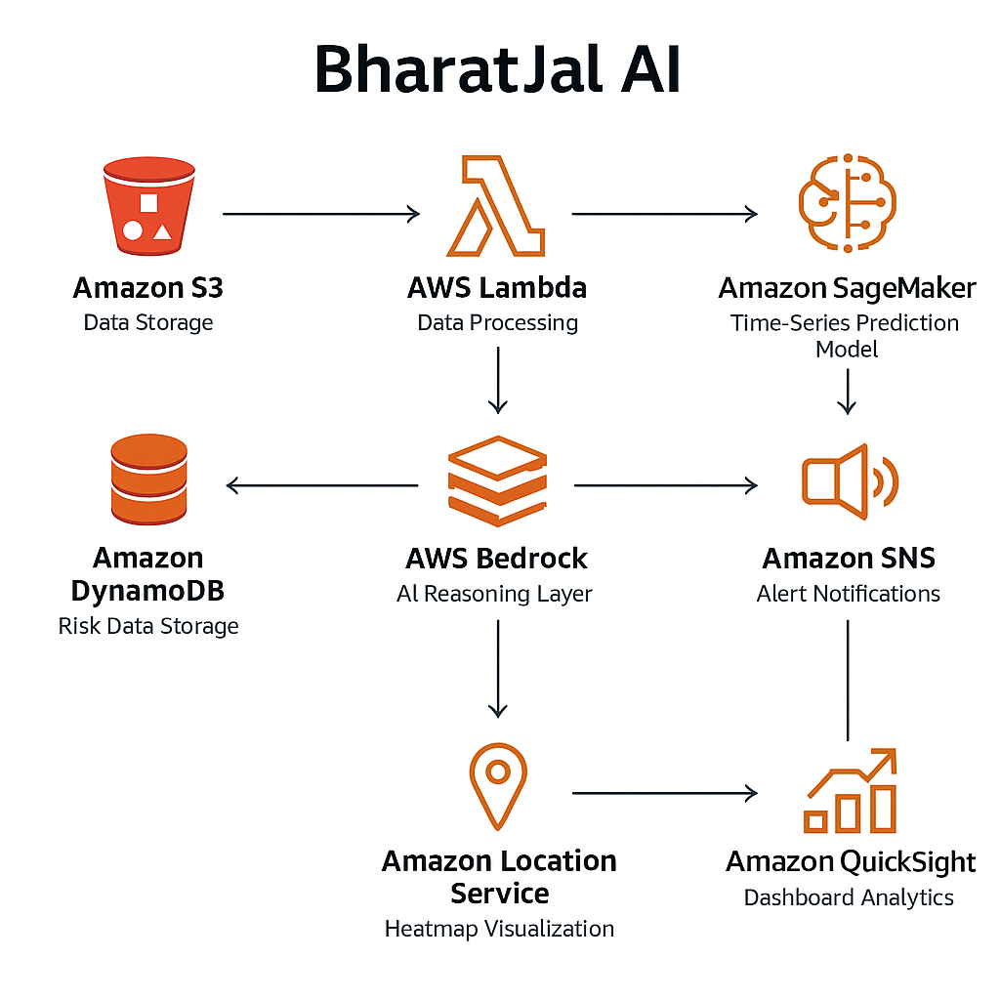
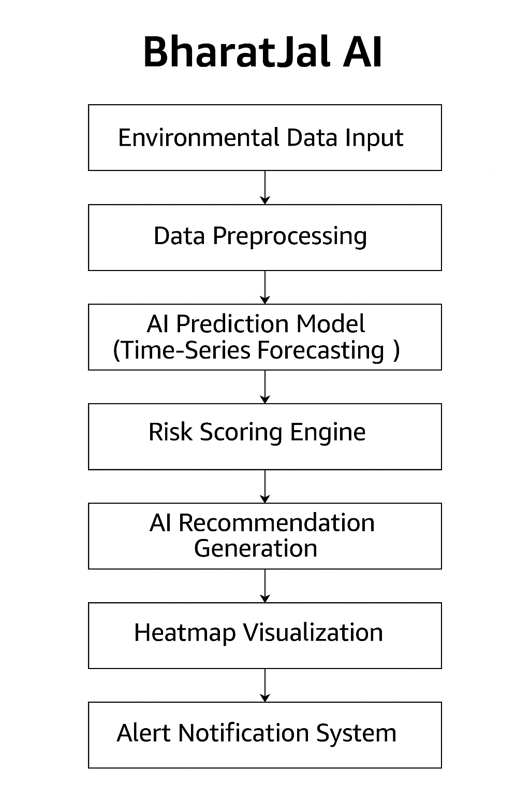

# BharatJal AI - System Design Document

## 1. System Overview

BharatJal AI is a cloud-native AI architecture that predicts groundwater depletion risk using multi-source environmental data. The system consists of four major layers:

1. Data Ingestion Layer
2. Prediction & Modeling Layer
3. Intelligence & Reasoning Layer
4. Visualization & Alert Layer

---

## 2. High-Level Architecture

### Architecture Flow:

1. Environmental datasets (groundwater, rainfall, crop data) are stored in Amazon S3.
2. AWS Lambda triggers preprocessing workflows.
3. Processed datasets are sent to Amazon SageMaker for time-series model training.
4. The trained model generates groundwater depletion predictions.
5. Risk scores are stored in DynamoDB.
6. AWS Bedrock interprets predictions and generates mitigation recommendations.
7. Amazon Location Service renders water stress heatmaps.
8. Amazon SNS sends alerts to stakeholders.
9. Amazon QuickSight displays dashboard analytics.

---

## 3. Detailed Component Design

### 3.1 Data Layer
- Amazon S3: Centralized data lake
- Data includes:
  - Historical groundwater levels
  - Rainfall records
  - Soil and land usage data
  - Crop patterns

### 3.2 Prediction Engine
- Amazon SageMaker:
  - Time-series forecasting model
  - Multi-variable regression analysis
  - Risk index classification
- Output:
  - Water Stress Risk Score (Low / Medium / High / Critical)
  - Depletion probability percentage

### 3.3 AI Reasoning Layer
- AWS Bedrock:
  - Converts prediction outputs into human-readable insights
  - Generates localized mitigation recommendations
  - Explains why a region is high risk

### 3.4 Visualization Layer
- Amazon Location Service:
  - Geospatial heatmap rendering
- Amazon QuickSight:
  - Trend dashboards
  - Forecast comparison charts

### 3.5 Alerting System
- Amazon SNS:
  - Sends alerts when risk crosses threshold
  - Notifies administrators

---

## 4. Data Flow Diagram

Data Flow Steps:

1. Data ingestion from multiple environmental sources
2. Preprocessing & normalization
3. Model training & inference
4. Risk scoring & classification
5. Insight generation
6. Visualization & notification

---

## 5. Scalability & Security

- Serverless architecture using Lambda
- Scalable storage via Amazon S3
- Modular ML pipeline
- IAM-based access control
- Encrypted data storage

---

## 6. Future Enhancements

- Satellite imagery integration
- Real-time sensor data ingestion
- Mobile app integration for rural alerts
- Policy simulation mode
